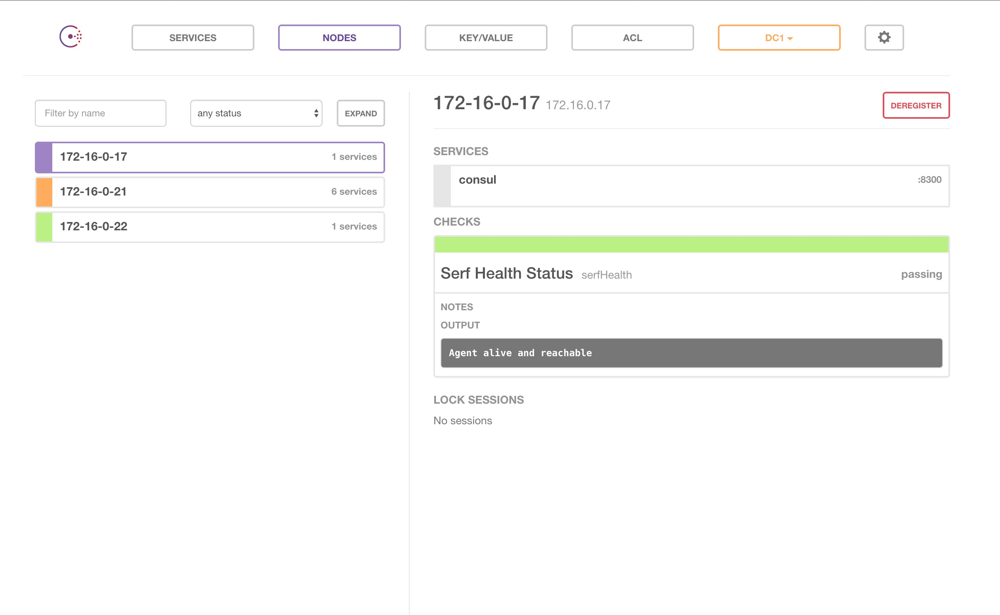
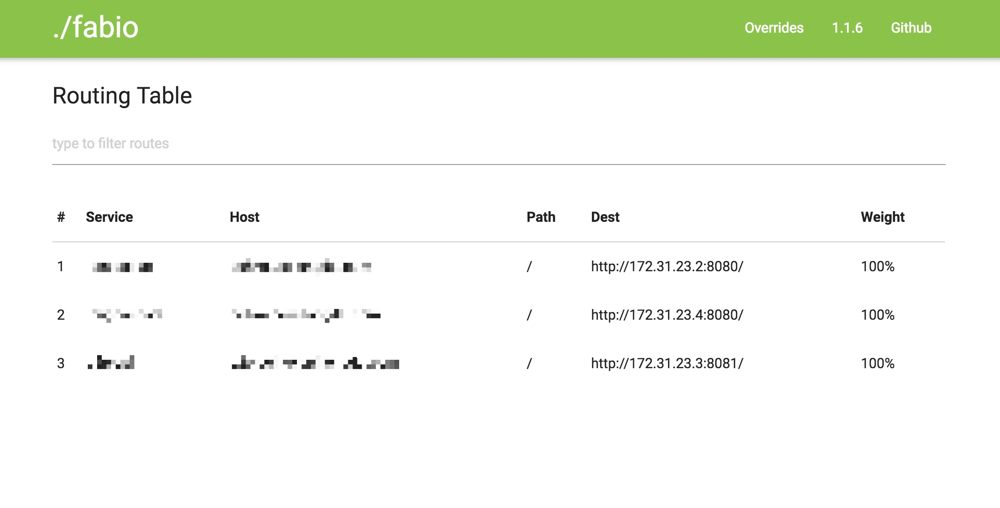
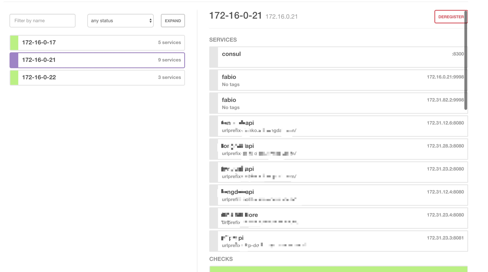

## Consul + fabio 实现自动服务发现、负载均衡

### 摘要
* Consul 介绍
* fabio  介绍
* 服务发现的特点
* 工作原理
* Demo
* 结合kubernetes扩容

### Consul

hashicorp团队开发 就是大名鼎鼎开发 vagrant 的团队

[Consul](https://www.consul.io/) 是一个提供服务发现、健康检测、K/V存储支持分布式高可用多数据中心的服务软件
比较类似ZooKeeper但又比它多了一些功能。 具体可以参考 [Consul和ZooKeeper的区别](http://dockone.io/article/300)

### fabio

fabio 是 ebay 团队用 golang 开发的一个快速、简单零配置能够让 consul 部署的应用快速支持 http(s) 的负载均衡路由器
因为 consul 支持服务注册与健康检查所以 fabio 能够零配置提供负载，升级部署从未如此简单。
根据项目的介绍fabio 能提供每秒15000次请求

有了这两个组件非常容易做服务发现与自动负载均衡, "神器在手、天下我有!" ^ _ ^

### 服务发现的特点

服务与服务之间的调用需要在配置文件中填写好主机和端口,不易于维护且分布式环境中不易于部署与扩容
那么此时就需要考虑服务启动的时候自己把主机和端口以及一些其他信息注册到注册中心，这样其他服务可以从中找到它
甚至更为简单的注册完毕后通过 DNS 的方式来『寻址』。比如 Zookeepr 可以很好的完成这个工作，但是其中还有一个弊端就是服务的健康检查服务注册到注册中心之后如何保证这个服务一定可用？此时就需要自己来写逻辑当服务不可用的时候自动从注册中心下线掉。 然后Consul 可以很轻易的解决这个问题

### 工作原理

Consul 提供了一套健康检测机制简单的说针对 http 类型的服务(consul 也支持 其他类型例如tcp)在注册的时候可以顺便注册下健康检测的信息，提供一个健康检测的地址(url)以及一个频率超时时间这样的话 consul 会定期的来请求当状态码是200的时候设置次服务是健康的状态否则是故障状态


既然注册到consul的服务能够自己维护健康状态此时 fabio 的工作就很简单了！ 就是直接从consul 注册表里面取出健康的服务根据服务注册时候的 tags 配置自动创建自己的路由表，然后当一个 http 请求过来的时候自动去做负载均衡

简单的流程图如下:

```
======    服务注册     =========       =========
  A服务   <------>      consul集群  ---->  健康的 A/不健康的 A 集群
======    健康检查     =========       =========
                                         ^
                                         | 加入/移出路由表
                                         |
                                      ========
                                       fabio 集群
                                      ========
                                         |
                                         | A服务   如果找到则成功路由否则返回错误
                                         V
                                        http 请求

 ```
### Demo

这里我们开始写一个 demo 服务来体验一波 consul+ fabio 顺便用 docker + k8s 来编排扩容

因为 consul + fabio 都支持 docker 的方式运行这里均以 docker 方式为例子

docker pull magiconair/fabio   

[docker pull consul](https://hub.docker.com/_/consul/)

consul 可以用集群的方式开发环境中也可以用 dev 模式 可以[参考这里](https://hub.docker.com/_/consul/)

这里可以参考我整理的单机部署 consul 集群的 docker compose 配置

```
version: '2'

services:
  consul_server_1:
    image: "consul:latest"
    container_name: "consul_server_1"
    environment:
      CONSUL_LOCAL_CONFIG: '{"leave_on_terminate": true}'
    networks:
      app_net:
        ipv4_address: 172.17.0.3
    command: "agent -server -bind=172.17.0.3 -client=172.17.0.3 -retry-join=172.17.0.2"

  consul_server_2:
    image: "consul:latest"
    container_name: "consul_server_2"
    ports:
      - "8600:8600"
      - "8500:8500"
    networks:
      app_net:
        ipv4_address: 172.17.0.4
    command: "agent -server -bind=172.17.0.4 -client=172.17.0.4 -retry-join=172.17.0.3 -ui"

  consul_server_3:
    image: "consul:latest"
    container_name: "consul_server_3"
    environment:
      CONSUL_LOCAL_CONFIG: '{"leave_on_terminate": true}'
    networks:
      app_net:
        ipv4_address: 172.17.0.5
    command: "agent -server -bind=172.17.0.5 -client=172.17.0.5 -retry-join=172.17.0.4 -bootstrap-expect=3"

networks:
  app_net:
    driver: bridge
    ipam:
      config:
      - subnet: 172.17.0.0/24
```
也可以按照 docker hub 上的文档自己部署, 启动成功之后访问下 consul ui



然后部署 faibo
docker-compose.yml

```
fabio:
  image: "magiconair/fabio"
  ports:
    - "9998:9998"
    - "9999:9999"
  volumes:
    - ./fabio.properties:/etc/fabio/fabio.properties
```

fabio 虽然说是零配置但是某些情况下还是需要个性化配置一些东西,此时可以去写一个简单的配置[fabio.properties](https://raw.githubusercontent.com/eBay/fabio/master/fabio.properties)

指定了 consul 的地址端口以及自身的一些统计信息等等

```
 registry.consul.register.addr = 172.16.0.21:9998

 registry.consul.addr = 172.16.0.21:8500
 
 metrics.target = stdout
```



fabio 不仅仅可以与 consul 结合可以以手动写一些路由规则
语法如下

```
route add <svc> <src> <dst> weight <w> tags "<t1>,<t2>,..."
  - Add route for service svc from src to dst and assign weight and tags

route add <svc> <src> <dst> weight <w>
  - Add route for service svc from src to dst and assign weight

```

[详情请移步](https://github.com/eBay/fabio/wiki/Routing#manual-overrides)

此时安装部署完毕之后跑一个 demo 试试

官方提供了一个简单的实现

```
package main

import (
	"flag"
	"fmt"
	"log"
	"net"
	"net/http"
	"os"
	"os/signal"
	"path/filepath"
	"strconv"
	"strings"

	"github.com/magiconair/fabio-example/_third_party/github.com/hashicorp/consul/api"
)

func main() {
	var addr, name, prefix string
	flag.StringVar(&addr, "addr", "127.0.0.1:5000", "host:port of the service")
	flag.StringVar(&name, "name", filepath.Base(os.Args[0]), "name of the service")
	flag.StringVar(&prefix, "prefix", "", "comma-sep list of host/path prefixes to register")
	flag.Parse()

	if prefix == "" {
		flag.Usage()
		os.Exit(1)
	}

	// register prefixes
	prefixes := strings.Split(prefix, ",")
	for _, p := range prefixes {
		http.HandleFunc(p, func(w http.ResponseWriter, r *http.Request) {
			fmt.Fprintf(w, "Serving %s from %s on %s\n", r.RequestURI, name, addr)
		})
	}

	// start http server
	go func() {
		log.Printf("Listening on %s serving %s", addr, prefix)
		if err := http.ListenAndServe(addr, nil); err != nil {
			log.Fatal(err)
		}
	}()

	// register consul health check endpoint
	http.HandleFunc("/health", func(w http.ResponseWriter, r *http.Request) {
		fmt.Fprintln(w, "OK")
	})

	// build urlprefix-host/path tag list
	// e.g. urlprefix-/foo, urlprefix-/bar, ...
	var tags []string
	for _, p := range prefixes {
		tags = append(tags, "urlprefix-"+p)
	}

	// get host and port as string/int
	host, portstr, err := net.SplitHostPort(addr)
	if err != nil {
		log.Fatal(err)
	}
	port, err := strconv.Atoi(portstr)
	if err != nil {
		log.Fatal(err)
	}

	// register service with health check
	serviceID := name + "-" + addr
	service := &api.AgentServiceRegistration{
		ID:      serviceID,
		Name:    name,
		Port:    port,
		Address: host,
		Tags:    tags,
		Check: &api.AgentServiceCheck{
			HTTP:     "http://" + addr + "/health",
			Interval: "1s",
			Timeout:  "1s",
		},
	}

	client, err := api.NewClient(api.DefaultConfig())
	if err != nil {
		log.Fatal(err)
	}

	if err := client.Agent().ServiceRegister(service); err != nil {
		log.Fatal(err)
	}
	log.Printf("Registered service %q in consul with tags %q", name, strings.Join(tags, ","))

	// run until we get a signal
	quit := make(chan os.Signal, 1)
	signal.Notify(quit, os.Interrupt, os.Kill)
	<-quit

	// deregister service
	if err := client.Agent().ServiceDeregister(serviceID); err != nil {
		log.Fatal(err)
	}
	log.Printf("Deregistered service %q in consul", name)
}

```

程序在启动的时候去注册并且注册了健康检测的地址/health,在退出的时候去取消注册,往 consul注册服务的时候有个 tags 可以允许给这个服务传一个标签 fabio 根据这个参数来自动关联路由映射

先跑下试试

```
CONSUL_HTTP_ADDR=172.16.0.21:8500 ./fabio-example -addr=172.16.0.17:9876 -prefix=a.com/
```
此时 consul 已经收到注册 fabio 路由已经添加

```
#	Service	Host	Path	Dest	Weight
1	fabio-example	a.com	/	http://172.16.0.17:9876/	100%
```

```
➜  ~ curl -iv -H 'Host: a.com' 172.16.0.21:9999/
*   Trying 172.16.0.21...
* Connected to 172.16.0.21 (172.16.0.21) port 9999 (#0)
> GET / HTTP/1.1
> Host: a.com
> User-Agent: curl/7.43.0
> Accept: */*
>
< HTTP/1.1 200 OK
HTTP/1.1 200 OK
< Content-Length: 49
Content-Length: 49
< Content-Type: text/plain; charset=utf-8
Content-Type: text/plain; charset=utf-8
< Date: Fri, 22 Jul 2016 01:01:28 GMT
Date: Fri, 22 Jul 2016 01:01:28 GMT

<
Serving / from fabio-example on 172.16.0.17:9876
* Connection #0 to host 172.16.0.21 left intact
```

### 结合kubernetes扩容
如果基于 k8s 做编排的话需要做一些修改例如: ip端口 要动态的从容器里面获取,服务启动的时候那个 tags prefix 需要配置,可以参考[fabio的文档](https://github.com/eBay/fabio/wiki)

这里我就用 java 快速搭建了一个, Spring框架提供了服务发现一条龙服务针对 consul 的就是 [spring-cloud-consul](https://github.com/spring-cloud/spring-cloud-consul/blob/master/docs/src/main/asciidoc/spring-cloud-consul.adoc) 只要一行代码 几行配置就能快速使用 ：)
Application类上添加@EnableDiscoveryClient注解

application.yml

```
spring:
  cloud:
    consul:
      discovery:
        healthCheckPath: ${management.contextPath}/health  #健康检测的路径 
        healthCheckInterval: 15s #健康检测的频率
        tags: urlprefix-api.xxxx.com/  #fabio 的路由规则
```

ps: spring 健康检测可以用 spring-boot-starter-actuator快速实现

然后 k8s 里面需要扩容就可以任性扩容了,因为如果不采用服务发现的方式 k8s 扩容时候可能 http 请求会转发到启动完毕的容器但是服务并不可用（例如 java 进程虽然启动了但是初始化可能需要几分钟...）


感受一下 扩容10个

```
$ kubectl scale --replicas=10 rc api

$ kubectl get pods

[root@172-16-0-17 fabio-example]# kubectl get pods
NAME                                             READY     STATUS    RESTARTS   AGE
api-6xytx                                         1/1       Running   0          11s
api-9e5838075aae036e2dc971984855e379-ac30s        1/1       Running   0          14h
api-dfmtv                                         1/1       Running   0          11s
api-eo01h                                         1/1       Running   0          11s
api-hn1kv                                         1/1       Running   0          11s
api-iyqmg                                         1/1       Running   0          11s
api-k32ud                                         1/1       Running   0          11s
api-q10a7                                         1/1       Running   0          11s
api-re7e1                                         1/1       Running   0          11s
api-tm2pk                                         1/1       Running   0          11s

```

10秒中瞬间扩容至10个 然后看下 consul 与 fabio



fabio

```

#	Service	Host	Path	Dest	            Weight
1	api	api.com   	/	http://172.31.9.3:8080/	    10%
2	api	api.com  	/	http://172.31.9.2:8080/	    10%
3	api	api.com	    /	http://172.31.82.6:8080/	10%
4	api	api.com	    /	http://172.31.82.4:8080/	10%
5	api	api.com	    /	http://172.31.28.3:8080/	10%
6	api	api.com   	/	http://172.31.28.2:8080/	10%
7	api	api.com	    /	http://172.31.23.7:8080/	10%
8	api	api.com	    /	http://172.31.23.2:8080/	10%
9	api	api.com	    /	http://172.31.12.6:8080/	10%
10	api	api.com    	/	http://172.31.12.4:8080/	10%
```


此时在收缩至一个的时候 fabio 也能立即更新路由表

===
通过 fabio+consul 的结合可以很轻松的在分布式环境中进行部署与扩容
另外 consul 还提供了一切其他的组建也可以完成类似的功能例如 [consul-template]（https://github.com/hashicorp/consul-template）


参考链接

* https://github.com/eBay/fabio/wiki/Configuration
* https://www.consul.io/docs/agent/basics.html
* http://cloud.spring.io/spring-cloud-consul/spring-cloud-consul.html