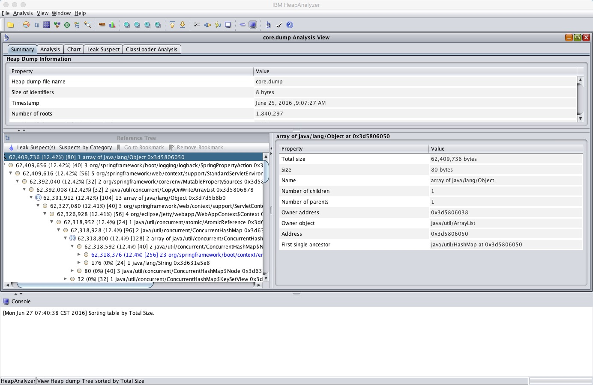
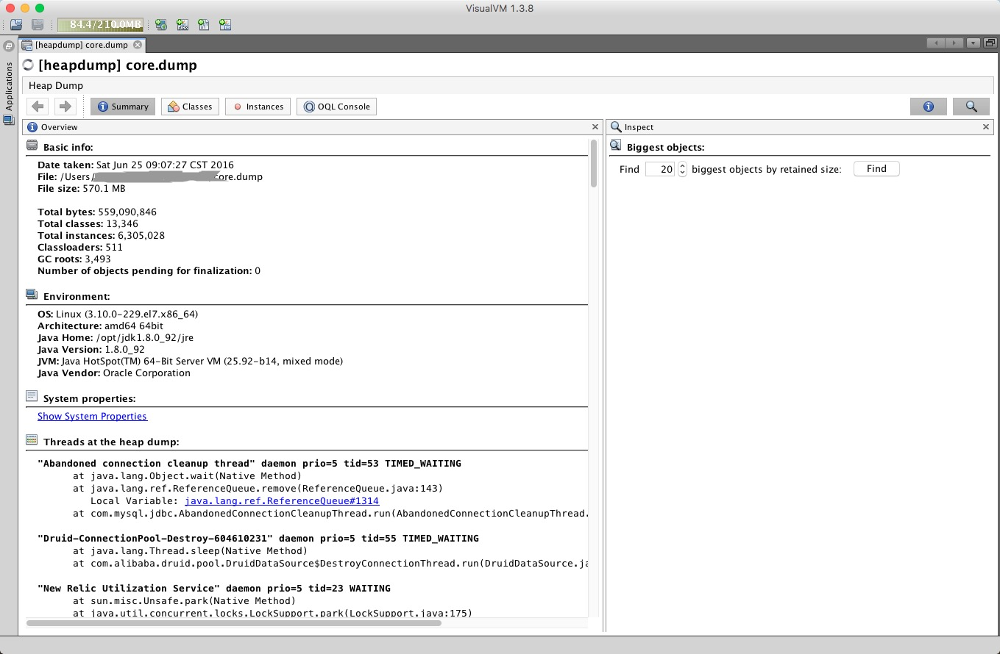
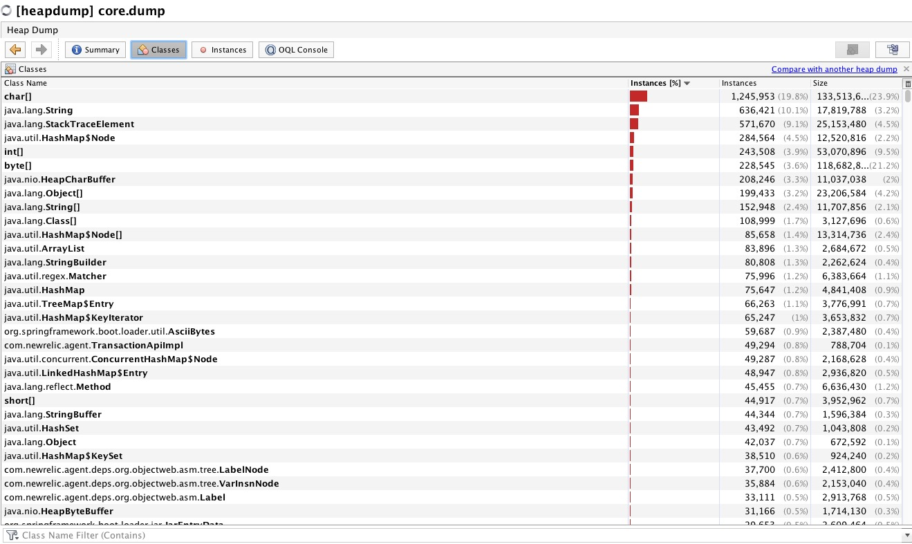
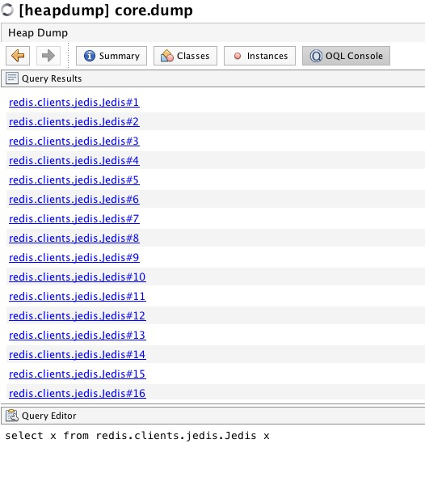
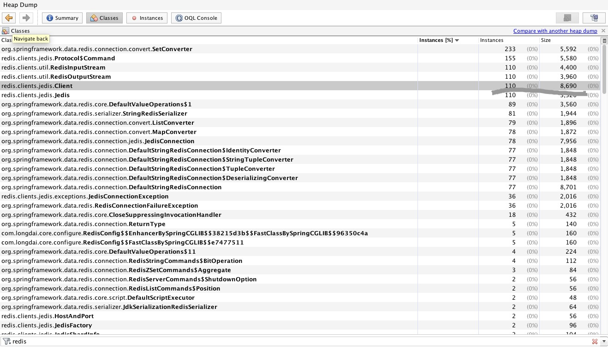
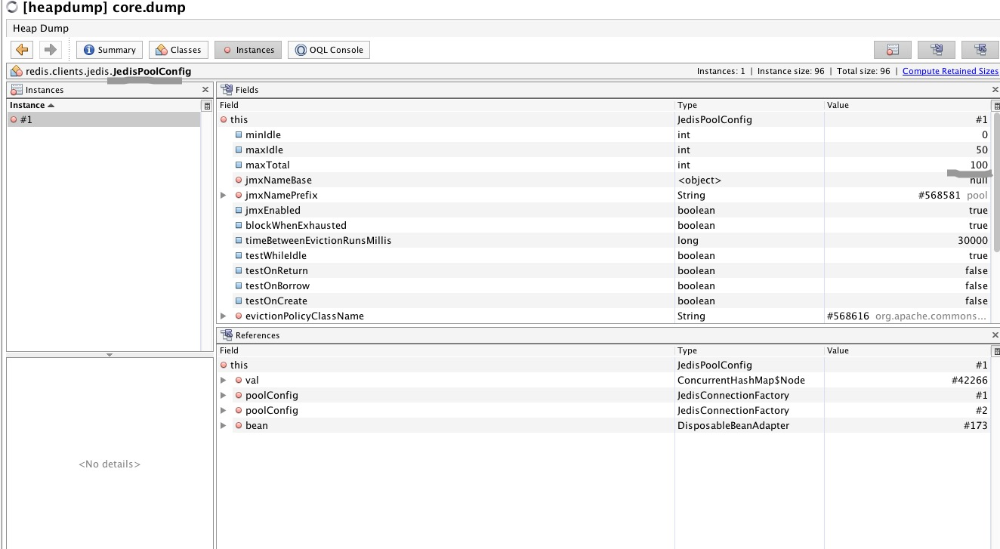
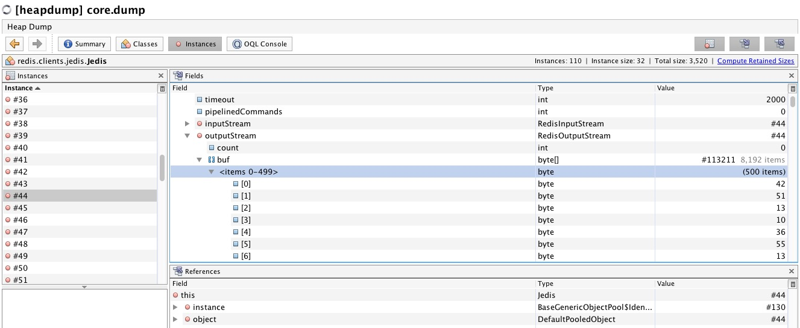
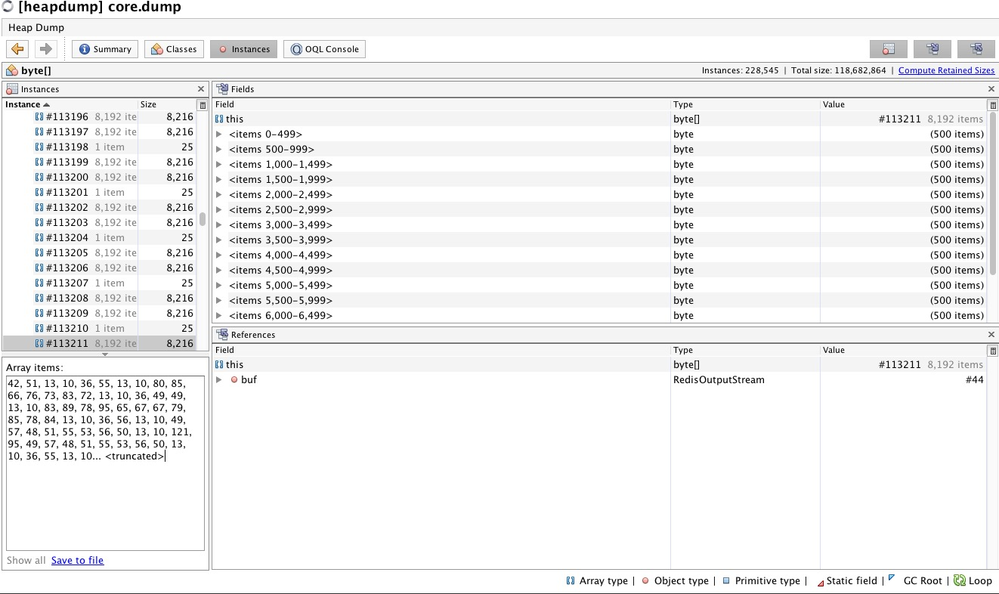

## 分析 heap dump 文件

分析 java 应用的一些问题可以获取 thread dump 来分析线程堆栈,但是分析线程不一定能找到问题这时候可以获取 heap dump 来进行下一步分析。

### 获取 thread dump 文件

```
jstack <pid> > file.tdump
```

关于thread dump 的信息可以[查看这里](http://jameswxx.iteye.com/blog/1041173)

heap dump 是 jvm 针对某一时刻生成的一份『快照』按照特定的格式保存到磁盘上，文件包含了很多信息例如 对象信息(包括对象的实例个数、各种字段的值) 、类信息、线程调用栈等等

### 手动获取 heap dump 文件 
```
jmap -dump:format=b,file=file.hprof <pid>
```
#### 自动获取 heap dump 文件
以Oracle JVM为例,在应用启动时配置相关的参数 -XX:+HeapDumpOnOutOfMemoryError，当应用抛出OutOfMemoryError时生成dump文件。-XX:HeapDumpPath 指定 dump 文件路径

这种方式获取的文件一般比较大几百兆吧,可以使用-dump:live选项只抓取当前存活的内存对象这样生成的 dump 文件会小一些
```
jmap -dump:live,format=b,file=file.hprof <pid>
```
dump 文件就可以用一些工具查看例如 jhat visual vm mat

如下所示

MAT



Visual VM



如图所示可以看出 heap dump 还保存了 Thread dump、以及系统的环境变量

===
下面以通过这个heap dump文件来找出redis 连接池泄露的问题举例

首先进入 classes 查看系统的所有类信息

可以看出每个类所占有的实例个数,大小,百分比

既然是找 redis 链接泄露则先找出 redis 的类信息,可以通过搜索 redis 关键字找到,也可以用OQL Console 输入查询语言快速搜索

```
select x from redis.clients.jedis.Jedis x
```






可以看到 jedis client 实例 占用了110个,而连接池配置的是100个肯定有某处代码没有回收

随便找一个 client 查看 流里面的信息看看当前执行的什么业务从而定位出问题




把这个二进制文件保存文件就可以看到个大概

最后问题定位到代码在有一处使用 redis 获取链接操作之后没有进行 close 导致的


#### 参考

[0] http://my.oschina.net/feichexia/blog/196575

[1] https://www.ibm.com/developerworks/cn/websphere/library/techarticles/0903_suipf_javadump/

[2] https://docs.oracle.com/javase/8/docs/technotes/tools/windows/java.html

[3] http://jameswxx.iteye.com/blog/1041173