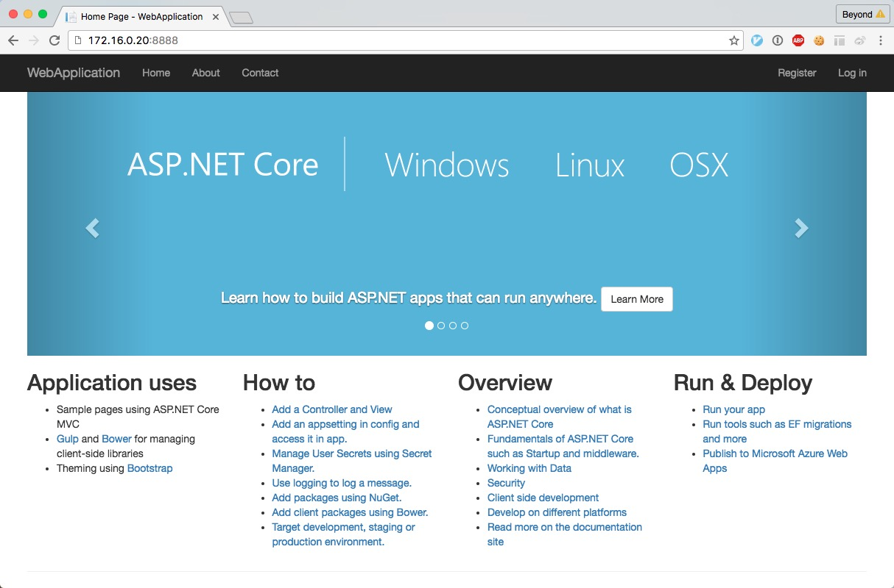

## .NET core for docker

本文描述下 .net core 在 docker 里面的玩法

首先按照[官方文档](https://www.microsoft.com/net/core#docker)先 拉取镜像

```
 docker pull microsoft/dotnet:latest
```

然后就有了 dotnet 这个运行时了,这里以一个 web 项目举例子
先创建一个 web 类型的 project

```
dotnet new -t web
```
如果本地没有 dotnew 运行时可以docker run 一个

```
docker run --rm -it -v /home/hello_dotnet/:/home/hello_dotnet/  microsoft/dotnet:latest
```

上面这个命令的意思是 让 docker 运行(`docker run`)一个dotnet:latest的镜像(`microsoft/dotnet:latest`) 并且把本地的/home/hello_dotnet卷路径挂载到容器的/home/hello_dotnet 下面(`-v /home/hello_dotnet/:/home/hello_dotnet/`)然后提供交互式模式能够输入输出(`-it`)退出之后自动删除容器(`--rm`)

然后进入容器生成类似这样

```
[root@172-16-0-20 home]# docker run --rm -it -v /home/hello_dotnet/:/home/hello_dotnet/  microsoft/dotnet:latest
root@193fb1cf32a6:/# cd /home/hello_dotnet/
root@193fb1cf32a6:/home/hello_dotnet# dotnet new -t web
Created new C# project in /home/hello_dotnet.
root@193fb1cf32a6:/home/hello_dotnet# ls
Controllers  Data  Models  Program.cs  README.md  Services  Startup.cs  Views  appsettings.json  bower.json  gulpfile.js  package.json  project.json  web.config  wwwroot
root@193fb1cf32a6:/home/hello_dotnet#
```

然后更新下包依赖

```
dotnet restore
```
直接运行

```
dotnet run
```

```
修改一下默认的监听端口 默认是 localhost:5000 不好做代理修改成 0.0.0.0

using System;
using System.Collections.Generic;
using System.IO;
using System.Linq;
using System.Threading.Tasks;
using Microsoft.AspNetCore.Hosting;

namespace WebApplication
{
    public class Program
    {
        public static void Main(string[] args)
        {
            var host = new WebHostBuilder()
                .UseUrls("http://0.0.0.0:5000") //添加这一行
                .UseKestrel()
                .UseContentRoot(Directory.GetCurrentDirectory())
                .UseIISIntegration()
                .UseStartup<Startup>()
                .Build();

            host.Run();
        }
    }
}

```

ok 没啥问题 publish 一下

```
root@193fb1cf32a6:/home/hello_dotnet# dotnet publish
Publishing hello_dotnet for .NETCoreApp,Version=v1.0
No executable found matching command "npm"
```
额,并不能够 publish 提示找不到 npm, npm 这个不是 node 的包依赖工具么。。
经过查看发现这个生成的 web 依赖了 gulp 所以很蛋疼 默认的容器只有运行时环境(可能主要是为了精简镜像)需要自己在安装 node

这里可以在容器里面把 node 装好或者去其他机器上 publish

```
apt-get update & apt-get install npm
```

并且安装完 npm 还不够 还需要 安装 bower gulp

```
No executable found matching command "bower"

```
```
No executable found matching command "gulp"
```
```
npm install bower -g

npm install gulp -g
```
ok 结束了...

```
Project hello_dotnet (.NETCoreApp,Version=v1.0) was previously compiled. Skipping compilation.
Configuring the following project for use with IIS: '/home/hello_dotnet/bin/Debug/netcoreapp1.0/publish'
Updating web.config at '/home/hello_dotnet/bin/Debug/netcoreapp1.0/publish/web.config'
Configuring project completed successfully
publish: Published to /home/hello_dotnet/bin/Debug/netcoreapp1.0/publish
Published 1/1 projects successfully
```
退出容器回到服务器上

```
root@193fb1cf32a6:/home/hello_dotnet/bin/Debug/netcoreapp1.0# exit
exit
[root@172-16-0-20 home]# ls
data  docker-compose  hello_dotnet  java  xiaoming  xiaoqiu
[root@172-16-0-20 home]# cd hello_dotnet/
[root@172-16-0-20 hello_dotnet]# ls
appsettings.json  bin  bower.json  Controllers  Data  gulpfile.js  Models  node_modules  obj  package.json  Program.cs  project.json  project.lock.json  README.md  Services  Startup.cs  Views  web.config  wwwroot
```
代码都已经创建好了,现在只要找个运行时 dotnet hello_dotnet.dll 就可以启动 web 了

打包一个镜像 写个 dockerfile 就好

先新建个工作目录整理下结构

```
[root@172-16-0-20 dotnet]# tree -L 2
.
├── Dockerfile
└── hello_dotnet
    ├── appsettings.json
    ├── bin
    ├── bower.json
    ├── Controllers
    ├── Data
    ├── gulpfile.js
    ├── Models
    ├── node_modules
    ├── obj
    ├── package.json
    ├── Program.cs
    ├── project.json
    ├── project.lock.json
    ├── README.md
    ├── Services
    ├── Startup.cs
    ├── Views
    ├── web.config
    └── wwwroot
```

```
```

```
[root@172-16-0-20 dotnet]# docker build -t "hello_dotnet:1.0" ./

[root@172-16-0-20 dotnet]# docker build -t "hello_dotnet:1.0" ./
Sending build context to Docker daemon 53.04 MB
Step 1 : FROM microsoft/dotnet:latest
 ---> 4028809f66a4
Step 2 : COPY hello_dotnet /home/www
 ---> 600558b4e65d
Removing intermediate container 0c05fc314674
Step 3 : WORKDIR /home/www
 ---> Running in b5b029517595
 ---> c9f05e277de9
Removing intermediate container b5b029517595
Step 4 : EXPOSE 8080
 ---> Running in 2a00bea9393c
 ---> b921fe0482f0
Removing intermediate container 2a00bea9393c
Step 5 : CMD dotnet hello_dotnet.dll
 ---> Running in f770b366be81
 ---> 11027359f344
Removing intermediate container f770b366be81
Successfully built 11027359f344
```
运行

```
[root@172-16-0-20 dotnet]# docker run  --rm -it -p 8888:5000 hello_dotnet:1.0
info: Microsoft.Extensions.DependencyInjection.DataProtectionServices[0]
      User profile is available. Using '/root/.aspnet/DataProtection-Keys' as key repository; keys will not be encrypted at rest.
Hosting environment: Production
Content root path: /home/www
Now listening on: http://0.0.0.0:5000
Application started. Press Ctrl+C to shut down.
```
浏览器访问 http://172.16.0.20:8888

ok 一切正常


当然也可以用守护进程的模式运行

```
docker run  -d  -p 8888:5000 hello_dotnet:1.0 
```

### 参考文档
[0] https://dotnet.github.io

[1] https://docs.docker.com/engine/reference/builder